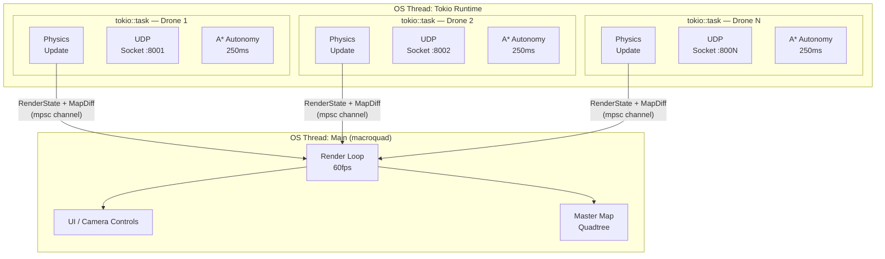
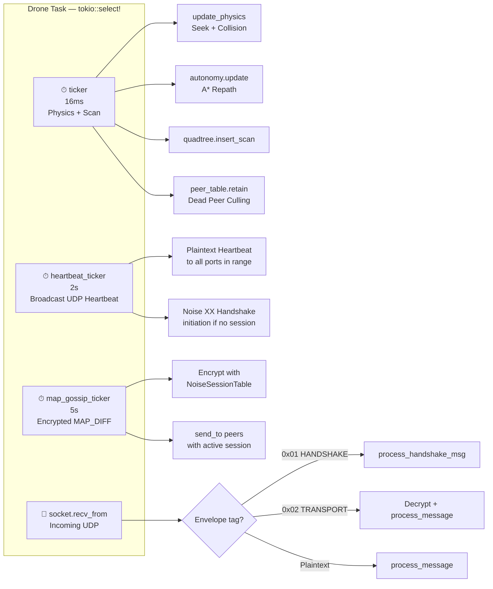
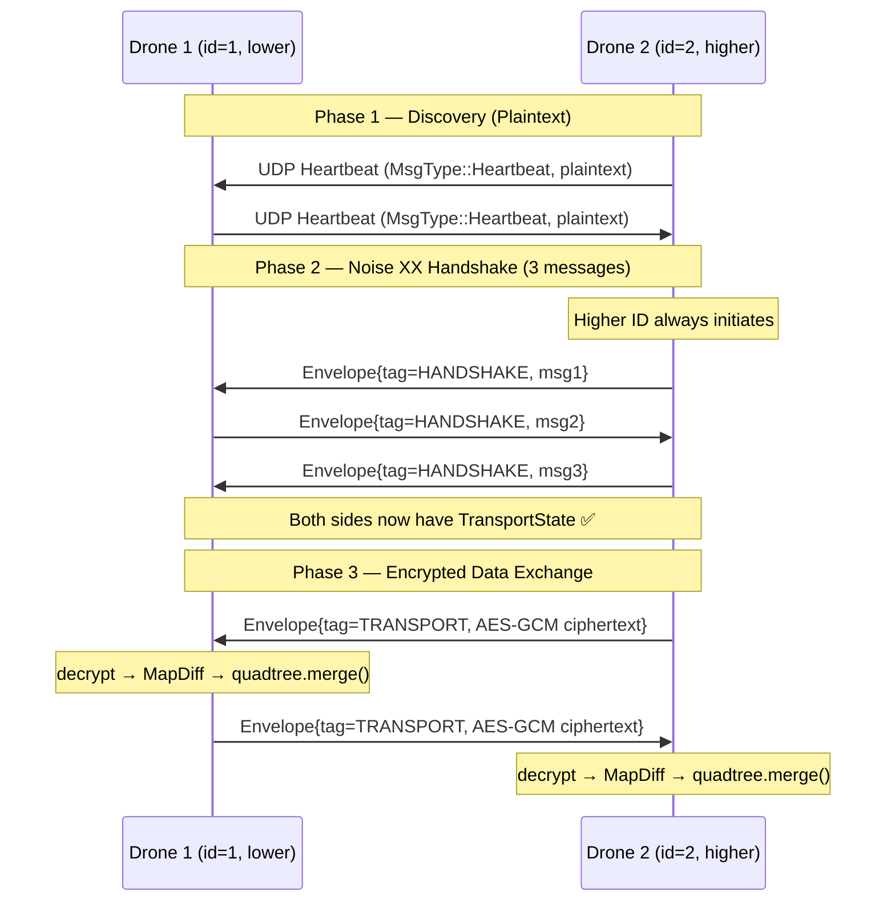
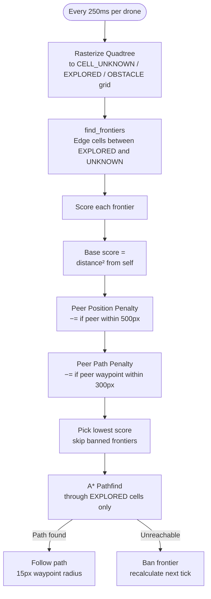
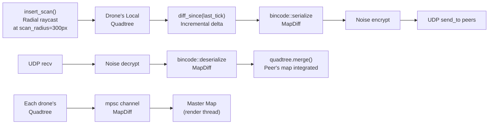

# System Architecture

## Overview

The simulator is structured as a **multi-actor system**. The main thread owns the render loop (macroquad / OpenGL). A background OS thread owns a Tokio async runtime, inside which each drone runs as an independent `tokio::task`. Communication between the render thread and drone tasks is strictly one-way: drones push state updates through an **unbounded MPSC channel**.

---

## 1. Process & Thread Model



> **Key design decision:** The render thread and drone tasks share **zero mutable state**. The quadtree is duplicated: each drone owns its own, and the render thread owns a `master_map` that merges diffs as they arrive. This avoids any `Arc<Mutex<T>>` and its associated lock contention.

---

## 2. Drone Actor Internals

Each drone task runs a `tokio::select!` loop with four concurrent arms:



---

## 3. Network Protocol Stack



**Role assignment rule:** The drone with the *higher* numeric ID always acts as the Noise **initiator**. The lower-ID drone waits and acts as **responder**. This is enforced with a single filter:
```rust
.filter(|&pid| pid > self.id)  // only initiate to higher-ID peers
```
This prevents both drones simultaneously trying to be initiator, which would corrupt the handshake state machine.

---

## 4. Swarm Coordination (Frontier Selection)



**Key insight:** Drones do not *negotiate* paths. Each drone independently applies a penalty to frontiers that peer drones are already heading toward, causing the swarm to naturally partition the map without a central coordinator.

---

## 5. Map Data Flow



---

## 6. Data Structures

| Structure | Owner | Purpose |
|-----------|-------|---------|
| `Quadtree` | Each `Drone` (1 copy) + `main.rs` (master) | Spatial map of explored/obstacle cells |
| `HashMap<u32, Peer>` | Each `Drone` | Live peer routing table; culled after `DEAD_PEER_TICKS` |
| `NoiseSessionTable` | Each `Drone` | Tracks handshake state and completed `TransportState` per peer |
| `AutonomyState` | Each `Drone` | A* path, target frontier, banned frontier list, repathing timers |
| `RenderState` | `main.rs` (`HashMap<u32, RenderState>`) | Latest snapshot of each drone for rendering |

---

## Phase Roadmap

| Phase | Status | Description |
|-------|--------|-------------|
| 1 | ✅ Done | Single drone, physics, quadtree mapping |
| 2 | ✅ Done | A* pathfinding, frontier exploration |
| 3 | ✅ Done | Multi-drone, async tokio actor model |
| 4 | ✅ Done | UDP gossip, Noise Protocol encryption, swarm coordination |
| 5 | 🔲 Next | Resilience: drone kill, RF jamming simulation |
| 6 | 🔲 Planned | Interactive demo: live spawn/kill, packet loss slider |
| 7 | 🔲 Optional | Perlin noise terrain, 3D upgrade via Bevy |
